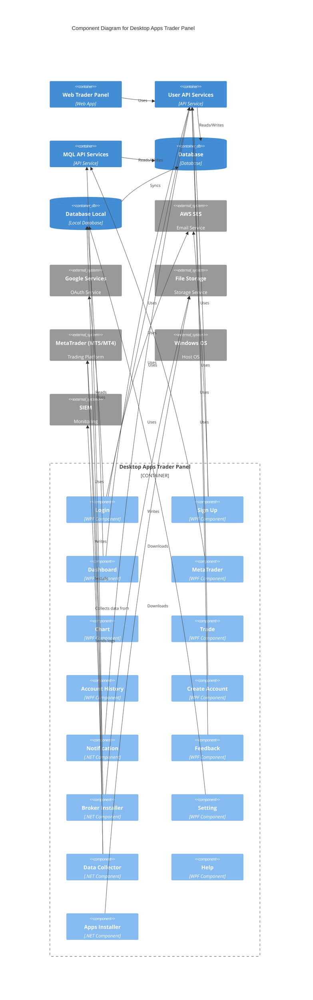

# Diagram Rule

## C4 Component Diagram

- `C4-Component-Diagrams.md` harus menggunakan Mermaid
- Untuk component diagram, gunakan syntax `C4Component`
- Nama komponen harus mengikuti nama artefak atau komponen aktual di repo, bukan label generik yang tidak traceable
- Relationship pada diagram harus tetap evidence-based; jika sebuah relasi belum terverifikasi dari code, tandai sebagai asumsi atau jangan digambar sebagai fakta implementasi

## Contoh Baseline Mermaid untuk C4 Component Diagram

