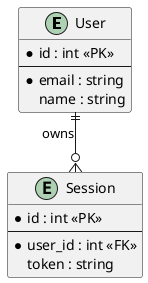
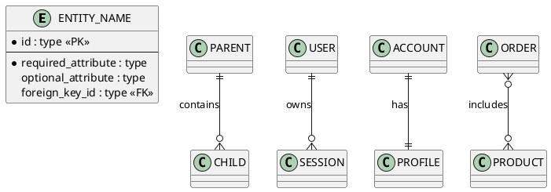
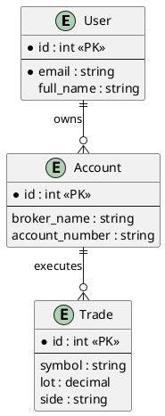
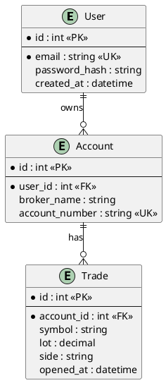
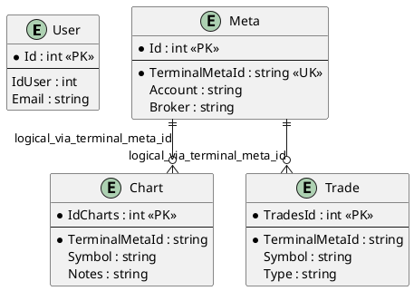

# Template ERD PlantUML IE

## Tujuan
Template ini mendefinisikan struktur dasar untuk membuat **Entity Relationship Diagram (ERD)** menggunakan **PlantUML Information Engineering (IE) Diagram**.

Referensi sintaks:
- PlantUML IE Diagram: https://plantuml.com/ie-diagram

Template ini dipakai ketika dokumentasi perlu menjelaskan:
- entitas data utama
- relasi antar entitas
- cardinality
- key constraints seperti `PK`, `FK`, `UK`
- atribut wajib vs opsional

## Prinsip
- Nama entity SHOULD menggunakan noun tunggal atau nama tabel yang benar-benar dipakai di codebase.
- ERD MUST berbasis bukti dari codebase:
  - entity/model class
  - database context
  - migration
  - SQL schema
  - DTO/proto bila relevan
- Gunakan relasi yang benar-benar terlihat dari code atau schema.
- Jika foreign key tidak jelas atau relasi hanya logical, dokumentasi MUST menuliskan itu secara eksplisit.
- Jika ada ketidakpastian, catat di bagian asumsi atau note dokumen yang memakai ERD.

## Struktur Dasar



## Template Umum



## Komponen Sintaks

### 1. Deklarasi Diagram

```plantuml
@startuml
...
@enduml
```



### 2. Skinparam yang Disarankan

Gunakan ini untuk menghindari crow's foot yang buruk saat garis miring:

```plantuml
skinparam linetype ortho
```

### 3. Entity Block

```plantuml
entity "User" as USER {
  *id : int <<PK>>
  --
  *email : string
  full_name : string
}
```

Catatan:
- `entity` adalah alias dari `class` dalam mode IE diagram
- `*` menandakan atribut mandatory
- `--` memisahkan identifying/key area dari atribut lainnya

### 4. Penanda Key

Gunakan stereotipe untuk membantu pembacaan:
- `<<PK>>`
- `<<FK>>`
- `<<UK>>`
- `<<generated>>` bila perlu

### 5. Cardinality Quick Reference

- Zero or one: `|o--`
- Exactly one: `||--`
- Zero or many: `}o--`
- One or many: `}|--`

Contoh:

```plantuml
USER ||--o{ SESSION : owns
USER ||--|| PROFILE : has
ORDER ||--|{ ORDER_ITEM : contains
STUDENT }o--o{ COURSE : enrolls_in
```

## Logical vs Physical Relation

### Physical relation

Gunakan bila FK benar-benar terlihat dari schema/ORM mapping:

```plantuml
ACCOUNT ||--o{ TRADE : has
```

### Logical relation

Gunakan bila relasi dipakai aplikasi, tetapi FK fisik tidak terlihat:

```plantuml
META ||--o{ CHART : logical_via_terminal_meta_id
```

Tambahkan penjelasan di dokumen pemakai bahwa ini relasi logis, bukan constraint FK database.

## Template ERD Logis



## Template ERD Fisik



## Panduan Pembuatan

### Step 1: Identifikasi Entity

Cari sumber bukti di:
- `DbContext`
- `Entities/`
- `Models/`
- migration
- schema/proto/contract

### Step 2: Tentukan Scope

Pilih salah satu:
- ERD sistem penuh
- ERD per feature
- ERD per aggregate/domain
- ERD untuk satu DCD atau use case tertentu

### Step 3: Daftar Atribut Minimum

Jangan selalu memaksakan semua kolom.

Minimal tampilkan:
- primary key
- foreign key penting jika memang membantu
- atribut identitas
- atribut status atau nilai yang penting untuk pemahaman

### Step 4: Validasi Relasi

Pastikan cardinality berasal dari bukti yang masuk akal:
- collection/list navigation
- FK relation
- migration/schema
- query shape
- business rule eksplisit

### Step 5: Tandai Level Kepastian

Jika relasi fisik tidak terlihat, tulis sebagai relasi logis dan jelaskan alasannya.

### Step 6: Tambahkan Note di Dokumen Pemakai

Jika ERD mengandung inferensi, dokumen yang memakai ERD SHOULD menambahkan:
- `Asumsi`
- `Perlu Dikonfirmasi`
- `Risiko Dokumentasi Tidak Lengkap`

## Contoh untuk Desktop App Domain



## Kapan Template Ini Dipakai

Gunakan template ini saat:
- mendokumentasikan storage/data model
- menjelaskan relasi entity dalam `DCD`
- melengkapi dokumentasi fitur yang banyak bergantung pada entitas data
- membuat diagram data untuk onboarding developer baru

## Kapan Tidak Dipakai

Jangan pakai ERD jika masalah utamanya adalah:
- flow runtime
- interaksi actor/use case
- dependency antar module
- lifecycle service/process

Untuk kasus itu, gunakan:
- sequence diagram
- use case diagram
- component diagram
- runtime architecture diagram
