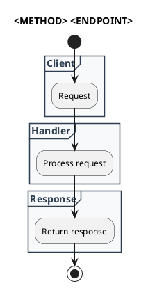
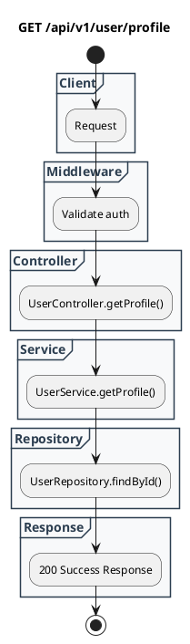

# Template REST API Spec

## Tujuan
Template ini mendefinisikan struktur standar untuk mendokumentasikan **REST API Specification**.

Template ini dipakai untuk mendokumentasikan:
- metadata endpoint
- alur proses endpoint
- parameter request
- body request
- response contract
- rule operasional dan non-fungsional

Template ini cocok dipakai saat:
- mendokumentasikan endpoint backend
- melengkapi planning/API design
- menjelaskan flow request-response untuk onboarding developer
- mendokumentasikan kontrak integrasi client-server

## Workspace dan Urutan Dokumen
- Dokumen REST API SHOULD disimpan di `.ai-doc/rest-api-doc/`.
- Artefak pertama dalam workflow REST API doc MUST berupa:
  - `daftar-endpoint.md`
- Setelah indeks endpoint tersedia, file detail endpoint dibuat satu per satu dengan format:
  - `API-SPEC-<nomor urut>-<Method>-<endpoint>.md`

## Prinsip
- REST API spec MUST berbasis bukti dari codebase, config, atau source of truth yang valid.
- Jika endpoint sudah ada di codebase, semua field SHOULD diturunkan dari:
  - router
  - controller/handler
  - service
  - validation layer
  - DTO/schema
  - middleware
  - response mapper
- Jika sebagian field belum jelas, dokumentasi MUST menandainya sebagai asumsi atau perlu dikonfirmasi.

## Penamaan File

Format yang dibakukan:

```text
API-SPEC-<nomor urut>-<Method>-<endpoint>.md
```

Contoh:
- `API-SPEC-01-GET-+api+v1+user+profile.md`
- `API-SPEC-02-POST-+api+v1+auth+login.md`
- `API-SPEC-03-GET-+api+v1+user+auth+google+callback+desktop.md`

Aturan konversi endpoint:
- ambil path endpoint
- konversi setiap `/` menjadi `+`
- pertahankan segmen path agar tetap mudah ditelusuri

Contoh:
- `/api/v1/user/profile` -> `+api+v1+user+profile`
- `/api/v1/user/auth/google/callback/desktop` -> `+api+v1+user+auth+google+callback+desktop`

Panduan:
- `API-SPEC` adalah prefix tetap untuk dokumen endpoint REST.
- `nomor urut` menggunakan dua digit atau lebih bila diperlukan.
- `Method` gunakan huruf besar seperti `GET`, `POST`, `PUT`, `PATCH`, `DELETE`.
- `endpoint` adalah hasil konversi path dengan aturan `/` menjadi `+`.

## Struktur Standar

```md
# REST API Spec

## 1. Metadata
## 2. Diagram Swimlane
## 3. API Spec
## 4. Rules
## 5. Asumsi, Risiko, dan Hal yang Perlu Dikonfirmasi
```

## 1. Metadata

Bagian ini merangkum identitas endpoint.

### Format

| Method | Endpoint | Description |
|--------|----------|-------------|
| GET | /api/v1/example | Penjelasan singkat endpoint |

### Panduan
- `Method`: `GET`, `POST`, `PUT`, `PATCH`, `DELETE`
- `Endpoint`: path endpoint lengkap
- `Description`: fungsi endpoint secara singkat dan teknis

## 2. Diagram Swimlane

Gunakan swimlane diagram untuk menjelaskan flow endpoint lintas layer.

Referensi:
- `.ai-doc/template/swimlane-diagram-template.md`

### Format Minimal



## 3. API Spec

Bagian ini mendeskripsikan kontrak request/response secara detail.

### 3.1 Authentication

Tuliskan model autentikasi endpoint.

Contoh:
- `None`
- `Bearer Token`
- `Basic Auth`
- `Session Cookie`
- `API Key`

### 3.2 Query Parameter

Gunakan bila endpoint menerima query parameter.

| Key | Required | Type | Description |
|-----|----------|------|-------------|
| search | No | string | Keyword pencarian |
| limit | No | integer | Batas jumlah data |

Jika tidak ada, tulis:
- `Tidak ada`

### 3.3 Path Parameter

Gunakan bila endpoint memakai path parameter.

| Key | Type | Description |
|-----|------|-------------|
| userId | string | Identifier user |

Jika tidak ada, tulis:
- `Tidak ada`

### 3.4 Header Parameter

| Key | Required | Type | Default | Description |
|-----|----------|------|---------|-------------|
| Authorization | Yes | string | - | Bearer token |
| X-Request-Id | No | string | auto-generated | Correlation id request |

Jika tidak ada, tulis:
- `Tidak ada`

### 3.5 Request Body

#### JSON

```json
{
  "exampleKey": "value"
}
```

#### Struktur Field

| Key | Required | Type | Description |
|-----|----------|------|-------------|
| exampleKey | Yes | string | Penjelasan field |

Jika endpoint tidak punya body:
- `Tidak ada`

### 3.6 Response

Dokumentasikan setiap response penting menggunakan format berikut:

**Code**: 200  
**Meaning**: Success  
**Condition**: Request berhasil diproses  
**JSON**:
```json
{ "success": true }
```

**Code**: 400  
**Meaning**: Bad Request  
**Condition**: Input tidak valid  
**JSON**:
```json
{ "message": "..." }
```

**Code**: 401  
**Meaning**: Unauthorized  
**Condition**: Auth gagal/tidak ada  
**JSON**:
```json
{ "message": "..." }
```

### 3.7 Notes

Tuliskan catatan tambahan seperti:
- response mapping
- special header behavior
- callback URI
- async/polling behavior
- id endpoint legacy

## 4. Rules

Bagian ini mendokumentasikan aturan endpoint dari sisi fungsional dan operasional.

### 4.1 Authentication

Tuliskan rule autentikasi:
- apakah wajib auth
- jenis auth
- siapa yang boleh mengakses

### 4.2 Validation

Tuliskan rule validasi:
- required field
- format field
- enum/allowed values
- range/limit

### 4.3 Error Handling

Tuliskan mapping error penting:
- validation error
- unauthorized
- not found
- dependency failure
- upstream failure

### 4.4 Rate Limiting

Tuliskan rule rate limiting bila ada:
- global limit
- per-user limit
- per-IP limit
- upstream throttling

Jika belum terlihat:
- `Belum terlihat jelas di codebase`

### 4.5 Idempotency

Tuliskan:
- apakah endpoint idempotent
- jika tidak, apa konsekuensinya
- apakah perlu idempotency key

### 4.6 Security

Tuliskan rule keamanan:
- auth
- authorization
- header tertentu
- secret handling
- callback validation
- CSRF/CORS bila relevan

### 4.7 Non-Functional

Tuliskan aspek non-fungsional:
- timeout
- retry
- latency expectation
- audit logging
- observability

### 4.8 Dependency

Tuliskan dependency eksternal/internal:
- database
- cache
- upstream API
- queue
- OAuth provider
- internal service

### 4.9 Versioning

Tuliskan:
- versi endpoint
- policy perubahan versi
- legacy compatibility bila ada

## 5. Asumsi, Risiko, dan Hal yang Perlu Dikonfirmasi

Gunakan section ini jika ada bagian yang belum pasti.

### Asumsi
- daftar asumsi yang dipakai

### Risiko Dokumentasi Tidak Lengkap
- daftar risiko jika codebase tidak memperlihatkan seluruh flow

### Perlu Dikonfirmasi
- daftar hal yang butuh konfirmasi user/team

## Contoh Skeleton

```md
# REST API Spec

## 1. Metadata

| Method | Endpoint | Description |
|--------|----------|-------------|
| GET | /api/v1/user/profile | Mengambil profil user |

## 2. Diagram Swimlane



## 3. API Spec

### 3.1 Authentication
`Bearer Token`

### 3.2 Query Parameter
Tidak ada

### 3.3 Path Parameter
Tidak ada

### 3.4 Header Parameter

| Key | Required | Type | Default | Description |
|-----|----------|------|---------|-------------|
| Authorization | Yes | string | - | Bearer token |

### 3.5 Request Body
Tidak ada

### 3.6 Response

**Code**: 200  
**Meaning**: Success  
**Condition**: Profile ditemukan  
**JSON**:
```json
{ "data": { "id": 1 } }
```

**Code**: 401  
**Meaning**: Unauthorized  
**Condition**: Token tidak valid  
**JSON**:
```json
{ "message": "Unauthorized" }
```

### 3.7 Notes
- Endpoint memakai token user aktif.

## 4. Rules

### 4.1 Authentication
- Wajib bearer token.

### 4.2 Validation
- Token wajib valid.

### 4.3 Error Handling
- 401 untuk auth gagal.

### 4.4 Rate Limiting
- Belum terlihat jelas di codebase.

### 4.5 Idempotency
- GET bersifat idempotent.

### 4.6 Security
- Token tidak boleh kosong.

### 4.7 Non-Functional
- Request dicatat di request logger.

### 4.8 Dependency
- User repository
- database

### 4.9 Versioning
- `/api/v1`

## 5. Asumsi, Risiko, dan Hal yang Perlu Dikonfirmasi

### Asumsi
- Tidak ada

### Risiko Dokumentasi Tidak Lengkap
- Response body bisa memiliki field tambahan dari mapper.

### Perlu Dikonfirmasi
- Rate limit policy aktual.
```

## Kapan Template Ini Dipakai

Gunakan saat:
- mendokumentasikan endpoint REST
- menyusun planning API spec
- menjelaskan kontrak backend ke client/frontend
- mendokumentasikan callback/integration endpoint

## Kapan Tidak Dipakai

Jangan gunakan template ini untuk:
- gRPC contract murni
- event payload tanpa endpoint HTTP
- ERD atau Data Dictionary
- dependency antar module

Untuk itu, gunakan template lain yang sesuai.
