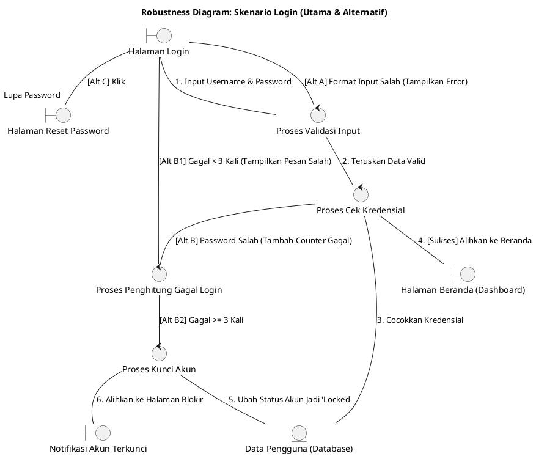

# Template Robustness Diagram

## Tujuan
Template ini mendefinisikan struktur dan konvensi untuk membuat diagram robustness (Robustness Diagram) dalam dokumentasi codebase. Diagram ini digunakan untuk mendokumentasikan interaksi antara elemen UI (boundary), logic (control), dan data (entity) dalam skenario utama dan alternatif.

## Prinsip
- Gunakan elemen `boundary` untuk UI, `control` untuk proses logika, dan `entity` untuk data.
- Sertakan title yang jelas dan deskripsi skenario.
- Label setiap alur dengan nomor dan keterangan [Sukses] / [Alt A] / [Alt B] dll.
- Hindari inferring dari nama file saja; semua klaim harus traceable ke code.
- Gunakan `skinparam packageStyle rect` untuk tampilan yang rapi.
- Update `.ai-doc/3p.md` setelah langkah yang bermakna.

## Struktur Diagram

