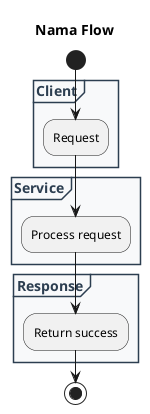
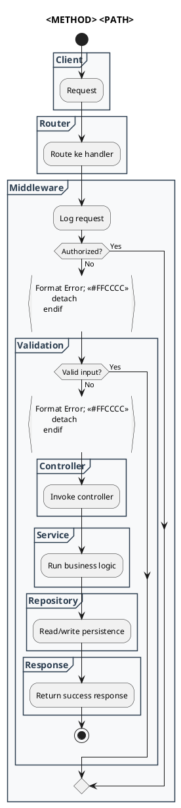
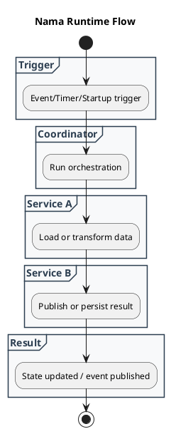

# Template Swimlane Diagram

## Tujuan
Template ini mendefinisikan struktur standar untuk membuat **swimlane diagram** menggunakan PlantUML.

Swimlane diagram dipakai untuk menjelaskan alur proses lintas peran atau lintas komponen seperti:
- client
- router
- middleware
- validation
- controller
- service
- repository
- error handling
- response

Template ini cocok dipakai saat:
- mendokumentasikan flow endpoint
- menjelaskan alur runtime request-response
- menjelaskan orchestration multi-layer
- melengkapi DCD atau dokumentasi API/feature

## Prinsip
- Diagram MUST berbasis bukti dari codebase.
- Gunakan lane hanya untuk komponen/peran yang benar-benar ada di flow.
- Lane SHOULD mewakili boundary proses yang jelas.
- Error path SHOULD ditampilkan jika memang penting untuk pemahaman flow.
- Jangan menambah lane dekoratif yang tidak membantu pembacaan.

## Struktur Dasar



## Contoh Standar

```plantuml
@startuml
skinparam shadowing false
skinparam partition {
    BackgroundColor #F8F9FA
    BorderColor #2C3E50
    FontColor #2C3E50
}

title **GET /api/v1/user/auth/google/callback/desktop**

start

partition "**Client**" {
    :Request;
}

partition "**Router**" {
    :Meneruskan request\nke handler get auth\ngoogle callback;
}

partition "**Middleware**" {
    :requestLogger\nmencatat log\npermintaan;

    if (Authorized\n(basic auth)?) then (Yes)
    else (No)
        :Format Error; <<#FFCCCC>>
        detach
    endif

    if (Lolos rate\nlimit?) then (Yes)
    else (No)
        :Format Error; <<#FFCCCC>>
        detach
    endif
}

partition "**Validation**" {
    if (Valid input\n(code)?) then (Yes)
    else (No)
        :Format Error; <<#FFCCCC>>
        detach
    endif
}

partition "**Controller**" {
    :UserController.googleCallback();
}

partition "**Service**" {
    :UserService.googleCallback();
    :connect ke oauth google\nuntuk mendapat data email\ndan id;

    if (berhasil) then (Yes)
    else (No)
        :Format Error; <<#FFCCCC>>
        detach
    endif

    :Cek user eksis;
    if (eksis?) then (Yes)
    else (No)
    endif
}

partition "**Repository**" {
    if (eksis?) then (Yes)
        :UserRepository.findByEmail(Email);
    else (No)
        :UserRepository.create(dto);
    endif
}

partition "**Error Handling**" {
    if (terjadi error) then (Yes)
        :translate message;
        if (unauthorized) then
            :401 Unauthorized; <<#FFCCCC>>
        elseif (too many request)
            :429 Too Many Request; <<#FFCCCC>>
        elseif (bad request)
            :400 Bad Request; <<#FFCCCC>>
        else
            :502 Bad Gateway; <<#FFCCCC>>
        endif
    else (No)
    endif
}

partition "**Response**" {
    if (terjadi error) then (Yes)
    else (No)
        :200 Success\nResponse;
    endif
}

stop

@enduml
```

## Konvensi Penulisan

### 1. Header

Gunakan:

```plantuml
@startuml
skinparam shadowing false
skinparam partition {
    BackgroundColor #F8F9FA
    BorderColor #2C3E50
    FontColor #2C3E50
}
```

### 2. Title

Gunakan title yang spesifik terhadap flow:
- endpoint
- use case
- background process
- command lifecycle

Contoh:
- `GET /api/v1/user/auth/google/callback/desktop`
- `Startup TraderPanel`
- `Sinkronisasi MetaTrader Snapshot`

### 3. Partition Naming

Gunakan nama lane yang jelas, misalnya:
- `Client`
- `UI`
- `Router`
- `Middleware`
- `Validation`
- `Controller`
- `Service`
- `Repository`
- `Database`
- `Error Handling`
- `Response`

Tidak semua lane wajib dipakai.

### 4. Action Formatting

- Gunakan `:` dan `;`
- Gunakan `\n` untuk line break jika teks panjang
- Gunakan verba aktif

Contoh:

```plantuml
:Meneruskan request\nke handler login;
```

### 5. Decision / Branch

Gunakan `if/then/else/endif`

Contoh:

```plantuml
if (Valid input?) then (Yes)
else (No)
    :Format Error; <<#FFCCCC>>
    detach
endif
```

### 6. Error Path

Untuk error yang mengakhiri flow, gunakan:

```plantuml
:Format Error; <<#FFCCCC>>
detach
```

Gunakan lane `Error Handling` bila ada translasi error atau mapping status yang penting.

## Template Generik Endpoint Flow



## Template Generik Runtime Flow



## Panduan Pembuatan

### Step 1: Tentukan Scope Flow

Pilih satu flow yang jelas:
- endpoint
- login/auth callback
- startup
- sync process
- background worker

### Step 2: Tentukan Lane

Ambil hanya lane yang benar-benar terlihat dari code:
- UI
- handler
- service
- repository
- database
- error mapping

### Step 3: Susun Happy Path

Tulis alur sukses lebih dulu dari atas ke bawah.

### Step 4: Tambahkan Guard/Error Path

Tambahkan hanya decision dan error yang penting:
- auth
- validation
- dependency failure
- persistence failure
- response mapping

### Step 5: Validasi terhadap Code

Bukti bisa diambil dari:
- route/handler
- controller
- service
- repository
- middleware
- event subscriber
- startup lifecycle

### Step 6: Tambahkan Catatan bila Perlu

Jika flow masih parsial, dokumentasi yang memakai template ini SHOULD menambahkan:
- `Asumsi`
- `Perlu Dikonfirmasi`
- `Risiko Dokumentasi Tidak Lengkap`

## Kapan Template Ini Dipakai

Gunakan saat:
- ingin menjelaskan alur proses lintas layer
- ingin menunjukkan siapa melakukan apa dalam satu flow
- ingin menjelaskan runtime behavior yang lebih detail daripada sequence ringkas

## Kapan Tidak Dipakai

Jangan pakai swimlane diagram jika kebutuhan utamanya adalah:
- relasi data entity
- dependency antar module
- daftar use case per actor

Untuk itu, gunakan:
- ERD
- component diagram
- use case diagram
