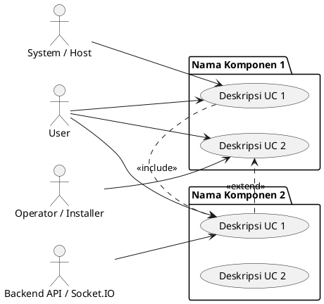

# Template Diagram Use Case

## Tujuan
Template ini mendefinisikan struktur dan konvensi untuk membuat diagram use case tergrup dalam dokumentasi codebase.

## Prinsip
- Diagram use case MUST menunjukkan interaksi antar **actor**, **package (komponen)**, dan **use case**.
- Use case SHOULD dikelompokkan per **komponen produk** atau **fitur utama**.
- Setiap use case SHOULD merepresentasikan aktivitas nyata dari user atau sistem yang terlihat di codebase.
- Relasi `<<include>>` dan `<<extend>>` SHOULD digunakan untuk menunjukkan dependency atau conditional flow antar use case.
- Nama package HARUS sama dengan nama komponen di section `3. Daftar Use Case per Komponen`.
- Nama label use case di diagram HARUS sama dengan nama use case di daftar komponen dan, jika ada, sama dengan `Use Case List` di DCD terkait.
- Hindari relasi atau aktor yang tidak punya bukti kode yang cukup kuat.
- Diagram berfungsi sebagai ringkasan visual, jadi jangan memadatkan ulang narasi panjang ke dalam nama use case.

## Struktur Diagram

## Konvensi Naming

### Identifer Use Case
- Format: `UC_<ComponentName>_<UseCaseShortName>`
- Contoh: `UC_Dashboard_Finance`, `UC_MetaTrader_Monitor`, `UC_Notification_Center`
- Gunakan PascalCase untuk component dan use case name.

### Deskripsi Use Case
- Tulis dalam bahasa Indonesia yang jelas dan singkat.
- Mulai dengan kata kerja imperatif: "Lihat...", "Ubah...", "Deteksi...", "Kumpulkan...", dll.
- Hindari terminologi teknis yang terlalu spesifik; gunakan bahasa yang dipahami user/operator.
- Gunakan nama yang sama persis dengan daftar use case di dokumen utama. Jangan membuat versi ringkas di diagram lalu versi panjang di section 3.

### Actor Definitions
- `User`: End-user aplikasi desktop.
- `Operator / Installer`: Pihak ketiga yang menjalankan operasi instalasi atau maintenance.
- `Backend API / Socket.IO`: Sistem eksternal (API backend, Socket.IO server, atau service lain).
- `System / Host`: runtime internal, scheduler, background worker, host service, atau OS-triggered behavior.
- Tambahkan actor lain jika diperlukan, misalnya `Database`, `MetaTrader Terminal`, `File System`.

## Relasi Antar Use Case

### `<<include>>`
- Gunakan jika use case A WAJIB memanggil / memerlukan use case B untuk selesai.
- Contoh: `UC_MetaMonitor ..> UC_DataCollectorMT : <<include>>`
  (Monitor MetaTrader WAJIB mengumpulkan data MetaTrader)

### `<<extend>>`
- Gunakan jika use case A DAPAT memperluas / menambah perilaku use case B secara conditional.
- Contoh: `UC_BrokerInstall ..> UC_MetaMonitor : <<extend>>`
  (Instalasi Broker DAPAT memperluas / menjalankan Monitor MetaTrader sebagai bagian prosesnya)

### Tidak Ada Relasi Eksplisit
- Jika use case berdiri sendiri tanpa relasi yang jelas, biarkan hanya berada dalam package-nya saja.

## Panduan Pembuatan

### Step 1: Identifikasi Komponen Produk
- Daftar seluruh komponen produk yang ingin didokumentasikan.
- Contoh: Apps Installer, Login, Sign Up, Dashboard, MetaTrader, Chart, Trade, Account History, Create Account, Broker Installer, Notification, Feedback, Setting, Data Collector, Help.

### Step 2: Identifikasi Use Case per Komponen
- Untuk setiap komponen, daftar aktivitas nyata yang user atau sistem lakukan.
- Basis: codebase (`Features/`, `Services/`, `ViewModels`, command handler, event, API endpoint).
- Susun nama use case sekali saja, lalu reuse nama yang sama di diagram, daftar komponen, dan DCD.
- Contoh untuk komponen **Dashboard**:
  - "Lihat ringkasan finansial" → berdasarkan `TraderPanel/Features/Dashboard/*` atau `TraderPanel/Core/Services/DashboardService.cs`.
  - "Lihat status device" → berdasarkan data collection atau monitoring service.
  - "Terima update dashboard" → berdasarkan WebSocket event atau polling dari Backend.

### Step 3: Identifikasi Actor
- Siapa yang melakukan use case tersebut?
  - User biasa? Operator? Backend service?
  - Tuliskan relasi actor-usecase dengan arrow `-->`.

### Step 4: Identifikasi Relasi Antar Use Case
- Apakah ada use case yang include atau extend use case lain?
- Gunakan `..> : <<include>>` atau `..> : <<extend>>` sesuai kebutuhan.
- Jangan terlalu banyak relasi; fokus pada dependency atau conditional flow yang penting.

### Step 5: Validasi dan Tinjau
- Pastikan setiap use case yang ditulis DAPAT ditelusuri ke codebase (file, class, method, atau feature).
- Jika tidak ada bukti di codebase, gunakan placeholder atau tandai sebagai "Belum teridentifikasi".
- Tanyakan ke user atau skip bagian tersebut jika tidak yakin.
- Pastikan diagram tidak menjadi duplikasi narasi section 3; cukup tampilkan nama use case, actor, package, dan relasi penting.

## Aturan Sinkronisasi dengan Dokumen Utama

- Urutan package di diagram SHOULD mengikuti urutan komponen pada section `3. Daftar Use Case per Komponen`.
- Jika sebuah komponen tidak punya relasi penting di diagram, tetap boleh ditampilkan sebagai package mandiri tanpa memaksa `include` atau `extend`.
- Jika dokumen utama memakai istilah `Status`, diagram tidak perlu mengulang status dalam label use case.
- Jika satu komponen punya banyak use case, pilih semua yang tercantum di dokumen utama, bukan subset acak.

## Contoh Standar (Dari Dokumentasi Komponen)

Lihat file `.ai-doc/Dokumentasi-Komponen-Usecase.md` untuk contoh lengkap yang sudah diterapkan dengan baik:
- Diagram tergrup per komponen produk.
- 15 komponen produk: Apps Installer, Login, Sign Up, Dashboard, MetaTrader, Chart, Trade, Account History, Create Account, Broker Installer, Notification, Feedback, Setting, Data Collector, Help.
- Relasi antar use case yang sudah tervalidasi terhadap codebase.

## Alat yang Digunakan
- PlantUML untuk rendering diagram.
- VS Code markdown preview atau tool online PlantUML untuk visualisasi.

## Kapan Update Template
- Jika ada prinsip baru yang ditemukan saat dokumentasi, update section ini.
- Jika ada naming convention yang berubah, update contoh di section ini.
- Setiap update MUST dicatat di `.ai-doc/3p.md` dengan penjelasan singkat.
