# C4 Component Diagrams: Lean Testing Platform & Two-Deck Control System

## Lean Testing & Two-Deck Dashboard Platform

### Deskripsi
Platform pengujian beban dan E2E browser mandiri (*lean & self-contained*) yang dilengkapi **Two-Deck Web Dashboard Control** berbasis Risograph Broadsheet Design System, SQLite database lokal, engine worker Playwright + Artillery/HttpLoadWorker, Headless CLI Runner, dan SSE realtime telemetry stream.

### Diagram

```mermaid
C4Component
    title Component Diagram for Lean Testing Platform with Two-Deck Architecture & CLI Runner

    Container(qaBrowser, "QA User Web Browser", "Chrome / Edge / Firefox", "Interactive Two-Deck Web Dashboard (HTML5 + Vanilla CSS/JS)")
    Container(ciClient, "CI/CD CLI Pipeline", "Terminal / GitHub Actions", "Headless CLI runner (npm run test:run)")
    ContainerDb(sqliteDb, "SQLite History DB", "Local File Storage", "./data/test_history.db with WAL mode")
    System_Ext(targetSut, "System Under Test (SUT)", "Target Web / API Service")
    Container(reportFiles, "Report Artifacts", "Static Files", "./reports/report.html and summary.json")

    Container_Boundary(platformBoundary, "Unified Platform Engine (Node.js + TypeScript)") {
        Component(twoDeckUi, "Two-Deck Web Dashboard", "Broadsheet UI", "Deck 1: Playwright E2E Studio, Deck 2: REST API Load Deck, Live Viewport Frame, Modal Inspector")
        Component(sseStream, "SSE Telemetry Streamer", "Server-Sent Events", "Pushes realtime RPS, p95 latency, active VUs, step progress, and screenshot events")
        Component(apiRoutes, "REST Control API", "HTTP API Endpoints", "Handles /api/runs (Start, Abort, History, Export HTML/JSON)")
        Component(cliRunner, "Headless CLI Runner", "src/cli.ts (TDD-009)", "CLI command runner for automated CI/CD runs with live terminal ticks and exit codes")
        Component(taskScheduler, "Task Scheduler & Queue", "In-Memory Async Queue (TDD-001)", "Dispatches tasks safely with concurrency throttle & abort signal")
        Component(pwStepExecutor, "PlaywrightStepExecutor", "Playwright (TDD-007)", "Deck 1: Sequential DOM actions (GOTO, CLICK, FILL, WAIT, ASSERT_TEXT), live screenshots, headers/auth injection")
        Component(apiChainExecutor, "ApiChainingExecutor", "Fetch API (TDD-008)", "Deck 2: Multi-step API chaining, {{var}} interpolation, header/auth injection, JSON path assertions")
        Component(httpLoadWorker, "HttpLoadWorker", "Fetch Worker (TDD-006)", "Deck 2: Real high-throughput load generation with VU scaling (fixed/ramp-up/spike) and quantiles")
        Component(reportGenerator, "ReportGenerator", "src/lib/server/report-generator.ts (TDD-010)", "Generates standalone self-contained offline HTML reports and structured JSON summaries")
        Component(storageRepo, "SqliteHistoryRepository", "better-sqlite3 (TDD-002)", "Persists test runs, step executions, and metric points in SQLite WAL mode")

        Rel(qaBrowser, twoDeckUi, "Loads Dashboard UI from")
        Rel(qaBrowser, sseStream, "Listens to /api/metrics/stream via SSE")
        Rel(qaBrowser, apiRoutes, "Triggers runs, aborts, and exports reports via HTTP")
        Rel(ciClient, cliRunner, "Executes headless test command")
        Rel(cliRunner, taskScheduler, "Dispatches execution jobs through engine")

        Rel(apiRoutes, taskScheduler, "Enqueues test run to")
        Rel(taskScheduler, pwStepExecutor, "Dispatches Deck 1 E2E jobs to")
        Rel(taskScheduler, apiChainExecutor, "Dispatches Deck 2 API Chain jobs to")
        Rel(taskScheduler, httpLoadWorker, "Dispatches Deck 2 Load jobs to")

        Rel(pwStepExecutor, targetSut, "Performs browser DOM actions on")
        Rel(apiChainExecutor, targetSut, "Sends chained HTTP requests to")
        Rel(httpLoadWorker, targetSut, "Generates concurrent traffic to")

        Rel(pwStepExecutor, sseStream, "Streams real-time step progress & screenshots to")
        Rel(httpLoadWorker, sseStream, "Streams per-second telemetry ticks to")

        Rel(pwStepExecutor, storageRepo, "Records step executions to")
        Rel(apiChainExecutor, storageRepo, "Records API step executions to")
        Rel(httpLoadWorker, storageRepo, "Records summary metrics & points to")

        Rel(apiRoutes, reportGenerator, "Invokes report export on")
        Rel(reportGenerator, reportFiles, "Exports standalone report.html & summary.json")
        Rel(reportGenerator, storageRepo, "Reads history and updates artifact paths in")
    }
```

### Komponen
| Komponen | Deskripsi | ID TDD | Teknologi |
|---|---|---|---|
| **Two-Deck Web Dashboard** | Antarmuka ganda: Deck 1 (Playwright E2E Studio + Live Viewport Frame) dan Deck 2 (REST API Load Deck + Live ApexCharts + 12-Metrics Summary). | `DCD-01` | Vanilla HTML5 / CSS3 / JS |
| **SSE Telemetry Streamer** | Endpoint `/api/metrics/stream` untuk mendorong telemetry ticks, step progress, dan event screenshot ke UI realtime. | `TDD-003` | Node.js Server-Sent Events |
| **REST Control API** | Endpoint `/api/runs`, `/api/runs/abort`, `/api/runs/:id/export/json`, `/api/runs/:id/export/html`. | `SCD-01` | Native Node.js HTTP Router |
| **Headless CLI Runner** | Script runner terminal (`npm run test:run`) untuk eksekusi tanpa browser di CI/CD pipeline. | `TDD-009` | Node.js CLI (`src/cli.ts`) |
| **Task Scheduler & Queue** | Mengatur antrean in-memory dan menjaga batas concurrency agar terhindar dari resource contention. | `TDD-001` | In-Memory Async Queue |
| **PlaywrightStepExecutor** | Engine eksekusi DOM interaktif step-by-step lengkap dengan live screenshot dan injeksi custom headers/auth. | `TDD-007` | Playwright Core |
| **ApiChainingExecutor** | Engine pengujian REST API chaining dengan ekstraksi token `{{var}}` dan asersi JSON path. | `TDD-008` | Native Fetch API |
| **HttpLoadWorker** | Engine pengujian beban HTTP nyata dengan variasi virtual users (fixed, ramp-up, spike) dan kalkulasi quantiles latency. | `TDD-006` | Native Async Fetch Worker |
| **ReportGenerator** | Modul ekspor laporan mandiri statis (`summary.json` dan `report.html` offline). | `TDD-010` | HTML5 / JSON Exporter |
| **SqliteHistoryRepository** | Repositori penyimpanan lokal SQLite (tabel `test_runs`, `test_executions`, `metric_points`). | `TDD-002` | `better-sqlite3` (WAL mode) |

### External Systems / Files
| System / File | Tipe | Fungsi |
|---|---|---|
| **SQLite DB (`test_history.db`)** | Local File Storage | Database riwayat pengujian lokal berkinerja tinggi (WAL mode). |
| **Report Artifacts (`./reports/`)** | File Storage | Berkas laporan mandiri `report.html`, `summary.json`, dan tangkapan layar `screenshots/*.png`. |
| **System Under Test (SUT)** | External Target | Aplikasi target web frontend atau REST API yang diuji. |

