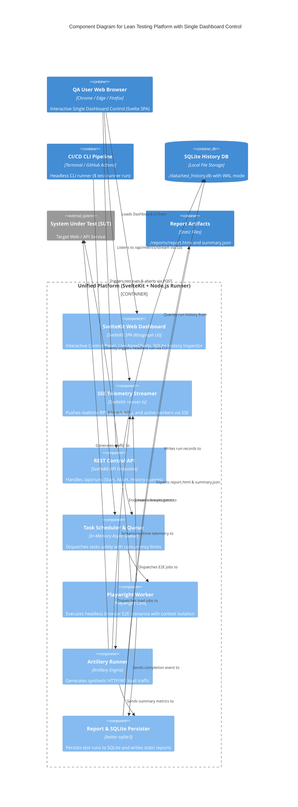

# C4 Component Diagrams: Lean Testing Platform & Single Dashboard Control

## Lean Testing & Single Dashboard Platform

### Deskripsi
Platform pengujian beban dan E2E browser mandiri (*lean & self-contained*) yang dilengkapi **Single Web Dashboard Control** berbasis SvelteKit & Risograph Broadsheet Design System, SQLite database lokal, engine worker Playwright + Artillery, dan SSE realtime telemetry stream.

### Diagram

### Komponen
| Komponen | Deskripsi | Teknologi |
|---|---|---|
| **SvelteKit Web Dashboard** | Single Dashboard Control dengan gaya Risograph Broadsheet (Control form, Live ApexCharts, History Inspector). | SvelteKit / Svelte 5 |
| **SSE Telemetry Streamer** | Endpoint `/api/metrics/stream` untuk mendorong metrik realtime ke browser tanpa WebSocket overhead. | Node.js Server-Sent Events |
| **REST Control API** | Endpoint `/api/runs` untuk memicu test run baru, membatalkan test (*abort*), dan membaca riwayat SQLite. | SvelteKit API Routes |
| **Task Scheduler & Queue** | Mengatur antrean in-memory dan menjaga batas concurrency agar VPS terhindar dari OOM. | In-Memory Async Queue |
| **Playwright Worker** | Worker browser headless dengan isolasi browser context per test case. | Playwright Core |
| **Artillery Runner** | Engine traffic generator untuk beban HTTP/WS volume tinggi. | Artillery Core |
| **Report & SQLite Persister** | Modul penyimpanan riwayat ke SQLite dan penulisan file `report.html` & `summary.json`. | `better-sqlite3` |

### External Systems / Files
| System / File | Tipe | Fungsi |
|---|---|---|
| **SQLite DB (`history.db`)** | Local File Storage | Database riwayat run mandiri (WAL mode). |
| **Report Files** | File Artifacts | Arsip laporan pengujian mandiri di folder `./reports/`. |
| **System Under Test (SUT)** | Target Web / API | Aplikasi target yang diuji performa dan fungsionalnya. |
