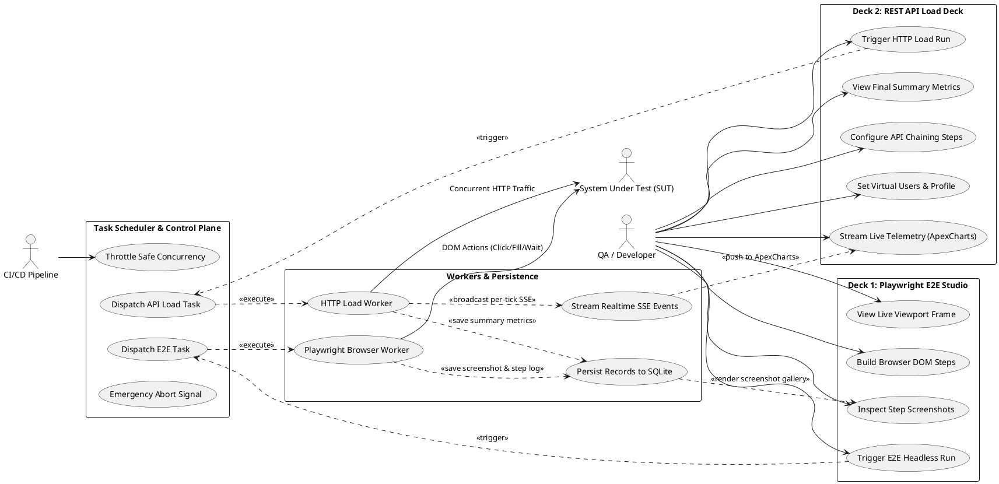

# Dokumentasi Komponen dan Use Case: Lean Testing & Two-Deck Dashboard

## 1. Ringkasan

Dokumen ini memetakan seluruh komponen dan use case untuk **Lean Load Testing & Dual-Deck Dashboard Platform**. Sistem memisahkan secara tegas dua ranah pengujian ke dalam antarmuka khusus:
1. **🎭 Playwright E2E Studio Deck:** Pengujian fungsional interaksi browser DOM nyata, form-filling, assertion teks visual, dan *Live Process Viewport Frame*.
2. **⚡ REST API Load Deck (Artillery Engine):** Otomatisasi alur REST API berantai (*API Chaining*), penembakan beban masif dengan Virtual Users (1–100), dan visualisasi metrik performa (RPS, Latensi p50..p99, Error Rate).

---

## 2. Diagram Use Case Tergrup

---

## 3. Daftar Use Case per Komponen

### 3.1 Deck 1: Playwright E2E Studio (Halaman Browser Automation)
**Status**: ✅ **Active / Planned Enhancements**  
**Design Reference**: [.ai-doc/DESIGN.md](file:///home/ubuntu/workspace/minilab/pentest/.ai-doc/DESIGN.md)

Deskripsi:
Halaman terdedikasi untuk perancangan dan eksekusi pengujian visual browser Playwright. Dilengkapi antarmuka step builder (`GOTO`, `CLICK`, `FILL`, `WAIT`, `ASSERT_TEXT`, `SCREENSHOT`), *Interactive Live Viewport Frame*, dan *Screenshot Evidence Gallery*.

Use case terverifikasi:
- ⏳ `Build Browser DOM Steps` (`UC-E2E-01`, **Planned**)
- ✅ `Trigger E2E Headless Run` (`UC-E2E-02`, **Active**)
- ⏳ `View Live Viewport Frame` (`UC-E2E-03`, **Planned**)
- ✅ `Inspect Step Screenshots` (`UC-E2E-04`, **Active**)

---

### 3.2 Deck 2: REST API Load Deck (Halaman Performance & API Chaining)
**Status**: ✅ **Active / Implemented**  
**Spec Reference**: [.ai-doc/plan/component/SCD-03-Load-Generator-Artillery.md](file:///home/ubuntu/workspace/minilab/pentest/.ai-doc/plan/component/SCD-03-Load-Generator-Artillery.md)

Deskripsi:
Halaman terdedikasi untuk otomatisasi REST API berantai (*API Chaining*) dan pengujian beban traffic tinggi. Dilengkapi builder konfigurasi endpoint (Method, Headers, Body, Token Extraction `{{var}}`), slider Virtual Users (1–100), grafik ApexCharts multi-series live stream, dan panel ringkasan 12 metrik quantile (p50..p99).

Use case terverifikasi:
- ⏳ `Configure API Chaining Steps` (`UC-API-01`, **Planned**)
- ✅ `Set Virtual Users & Profile` (`UC-API-02`, **Active**)
- ✅ `Trigger HTTP Load Run` (`UC-API-03`, **Active**)
- ✅ `Stream Live Telemetry (ApexCharts)` (`UC-API-04`, **Active**)
- ✅ `View Final Summary Metrics` (`UC-API-05`, **Active**)

---

### 3.3 Task Scheduler & Control Plane
**Status**: ✅ **Active / Implemented**  
**Spec Reference**: [.ai-doc/plan/component/SCD-01-Test-Orchestrator.md](file:///home/ubuntu/workspace/minilab/pentest/.ai-doc/plan/component/SCD-01-Test-Orchestrator.md)

Deskripsi:
Pengatur alur antrean tugas in-memory dengan throttle concurrency (2–4 worker) dan sinyal emergency abort instan untuk kedua deck.

Use case terverifikasi:
- ✅ `Throttle Safe Concurrency` (`UC-SCHED-01`, **Active**)
- ✅ `Dispatch E2E Task` (`UC-SCHED-02`, **Active**)
- ✅ `Dispatch API Load Task` (`UC-SCHED-03`, **Active**)
- ✅ `Emergency Abort Signal` (`UC-SCHED-04`, **Active**)

---

### 3.4 Persistence & Telemetry Streaming
**Status**: ✅ **Active / Implemented**  
**Database Reference**: [.ai-doc/desain-database-document/ERD-overview.md](file:///home/ubuntu/workspace/minilab/pentest/.ai-doc/desain-database-document/ERD-overview.md)

Deskripsi:
Layanan backend yang mengalirkan metrik realtime via SSE endpoint (`/api/metrics/stream`), menyimpan riwayat ke SQLite WAL mode (`history.db`), dan melayani binary screenshot image.

Use case terverifikasi:
- ✅ `Write Run Records to SQLite` (`UC-DATA-01`, **Active**)
- ✅ `Stream SSE Metrics` (`UC-DATA-02`, **Active**)
