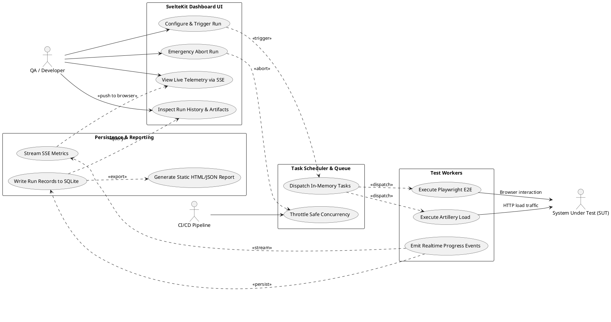

# Dokumentasi Komponen dan Use Case: Lean Testing & Single Dashboard

## 1. Ringkasan

Dokumen ini memetakan seluruh komponen dan use case untuk **Lean Load Testing & Single Dashboard Platform**. Sistem ini memadukan **Single Web Dashboard Control** berbasis SvelteKit (Risograph Broadsheet UI) dengan engine pengujian Playwright & Artillery serta database lokal SQLite.

---

## 2. Diagram Use Case Tergrup

---

## 3. Daftar Use Case per Komponen

### 3.1 SvelteKit Dashboard UI (Risograph Broadsheet)
**Status**: ✅ **Ada (Planned)**  
**Design Reference**: [.ai-doc/DESIGN.md](file:///home/ubuntu/workspace/minilab/pentest/.ai-doc/DESIGN.md)

Deskripsi:
Antarmuka web interaktif single-page yang menyajikan panel kontrol trigger, tombol emergency abort, visualisasi ApexCharts realtime via SSE, serta tabel riwayat run dan screenshot inspector.

Use case yang terverifikasi:
- ✅ `Configure & Trigger Run` (`UC-UI-01`, **Active**)
- ✅ `Emergency Abort Run` (`UC-UI-02`, **Active**)
- ✅ `View Live Telemetry via SSE` (`UC-UI-03`, **Active**)
- ✅ `Inspect Run History & Artifacts` (`UC-UI-04`, **Active**)

---

### 3.2 Task Scheduler & In-Memory Queue
**Status**: ✅ **Ada (Planned)**

Deskripsi:
Modul orkestrasi internal yang mengatur antrean eksekusi task, menerapkan batas aman concurrency agar VPS tidak OOM, dan menangani sinyal abort instan.

Use case yang terverifikasi:
- ✅ `Throttle Safe Concurrency` (`UC-SCHED-01`, **Active**)
- ✅ `Dispatch In-Memory Tasks` (`UC-SCHED-02`, **Active**)

---

### 3.3 Test Workers (Playwright + Artillery)
**Status**: ✅ **Ada (Planned)**

Deskripsi:
Worker eksekutor yang menjalankan skenario headless browser (Playwright) dengan isolasi context dan pembangkit lalu lintas HTTP volume tinggi (Artillery).

Use case yang terverifikasi:
- ✅ `Execute Playwright E2E` (`UC-WORK-01`, **Active**)
- ✅ `Execute Artillery Load` (`UC-WORK-02`, **Active**)
- ✅ `Emit Realtime Progress Events` (`UC-WORK-03`, **Active**)

---

### 3.4 Persistence & Reporting (SQLite + SSE)
**Status**: ✅ **Ada (Planned)**  
**Database Reference**: [.ai-doc/desain-database-document/ERD-overview.md](file:///home/ubuntu/workspace/minilab/pentest/.ai-doc/desain-database-document/ERD-overview.md)

Deskripsi:
Layanan backend yang mengalirkan metrik realtime via SSE endpoint (`/api/metrics/stream`), menyimpan riwayat ke SQLite (`history.db`), dan men-generate file laporan statis.

Use case yang terverifikasi:
- ✅ `Write Run Records to SQLite` (`UC-DATA-01`, **Active**)
- ✅ `Stream SSE Metrics` (`UC-DATA-02`, **Active**)
- ✅ `Generate Static HTML/JSON Report` (`UC-DATA-03`, **Active**)
