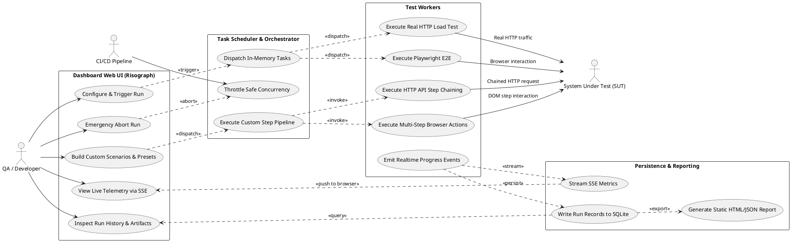

# Dokumentasi Komponen dan Use Case: Lean Testing & Single Dashboard

## 1. Ringkasan

Dokumen ini memetakan seluruh komponen dan use case untuk **Lean Load Testing & Single Dashboard Platform**. Sistem ini memadukan **Single Web Dashboard Control** (Risograph Broadsheet UI) dengan engine pengujian Playwright E2E, Real HTTP Load Generator, Custom Scenarios Pipeline, dan database lokal SQLite.

---

## 2. Diagram Use Case Tergrup

---

## 3. Daftar Use Case per Komponen

### 3.1 Dashboard Web UI (Risograph Broadsheet)
**Status**: ✅ **Ada (Active)**  
**Design Reference**: [.ai-doc/DESIGN.md](file:///home/ubuntu/workspace/minilab/pentest/.ai-doc/DESIGN.md)

Deskripsi:
Antarmuka web interaktif single-page yang menyajikan panel kontrol trigger, konfigurasi VUs/Duration/Load Profile, tombol emergency abort, visualisasi ApexCharts 3-series realtime via SSE, tabel riwayat run dengan inspector modal, serta visual builder untuk custom scenarios.

Use case yang terverifikasi:
- ✅ `Configure & Trigger Run` (`UC-UI-01`, **Active**)
- ✅ `Emergency Abort Run` (`UC-UI-02`, **Active**)
- ✅ `View Live Telemetry via SSE` (`UC-UI-03`, **Active**)
- ✅ `Inspect Run History & Artifacts` (`UC-UI-04`, **Active**)
- ⏳ `Build Custom Scenarios & Presets` (`UC-UI-05`, **Planned**)

---

### 3.2 Task Scheduler & Test Orchestrator
**Status**: ✅ **Ada (Active)**  
**Spec Reference**: [.ai-doc/plan/component/SCD-01-Test-Orchestrator.md](file:///home/ubuntu/workspace/minilab/pentest/.ai-doc/plan/component/SCD-01-Test-Orchestrator.md)

Deskripsi:
Modul orkestrasi internal yang mengatur antrean eksekusi task in-memory, menerapkan batas aman concurrency (2–4 worker) agar VPS aman dari OOM, menangani sinyal abort instan, dan mengorkestrasi pipeline eksekusi multi-step skenario kustom.

Use case yang terverifikasi:
- ✅ `Throttle Safe Concurrency` (`UC-SCHED-01`, **Active**)
- ✅ `Dispatch In-Memory Tasks` (`UC-SCHED-02`, **Active**)
- ⏳ `Execute Custom Step Pipeline` (`UC-ORCH-05`, **Planned**)

---

### 3.3 Test Workers (Playwright + HTTP Load Generator)
**Status**: ✅ **Ada (Active)**  
**Spec References**: 
- [.ai-doc/plan/component/SCD-02-Playwright-Worker-Pool.md](file:///home/ubuntu/workspace/minilab/pentest/.ai-doc/plan/component/SCD-02-Playwright-Worker-Pool.md)
- [.ai-doc/plan/component/SCD-03-Load-Generator-Artillery.md](file:///home/ubuntu/workspace/minilab/pentest/.ai-doc/plan/component/SCD-03-Load-Generator-Artillery.md)

Deskripsi:
Worker eksekutor yang menjalankan skenario headless browser (Playwright Chromium) dengan isolasi context dan pembangkit beban traffic HTTP nyata (`HttpLoadWorker`) dengan Virtual Users (1–100), durasi, dan load profiles (`fixed`, `ramp-up`, `spike`).

Use case yang terverifikasi:
- ✅ `Execute Playwright E2E` (`UC-WORK-01`, **Active**)
- ✅ `Execute Real HTTP Load Test` (`UC-WORK-02`, **Active**)
- ✅ `Emit Realtime Progress Events` (`UC-WORK-03`, **Active**)
- ⏳ `Execute Multi-Step Browser Actions` (`UC-WORK-04`, **Planned**)
- ⏳ `Execute HTTP API Step Chaining` (`UC-WORK-05`, **Planned**)

---

### 3.4 Persistence & Reporting (SQLite + SSE)
**Status**: ✅ **Ada (Active)**  
**Database Reference**: [.ai-doc/desain-database-document/ERD-overview.md](file:///home/ubuntu/workspace/minilab/pentest/.ai-doc/desain-database-document/ERD-overview.md)

Deskripsi:
Layanan backend yang mengalirkan metrik realtime via SSE endpoint (`/api/metrics/stream`), menyimpan riwayat run dan detail eksekusi ke SQLite WAL mode (`history.db`), dan men-generate file laporan ringkasan.

Use case yang terverifikasi:
- ✅ `Write Run Records to SQLite` (`UC-DATA-01`, **Active**)
- ✅ `Stream SSE Metrics` (`UC-DATA-02`, **Active**)
- ✅ `Generate Static HTML/JSON Report` (`UC-DATA-03`, **Active**)
