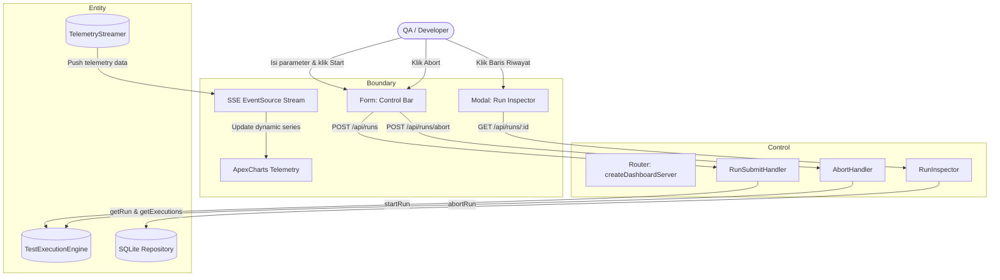

# DCD-01-Dashboard-Web-UI

> **Komponen:** Single Web Dashboard & Control Deck  
> **Source Code:** [`src/server.ts`](../../src/server.ts)  
> **Design Ref:** [DESIGN.md](../DESIGN.md)  
> **Status:** `Active / Implemented`  

---

## 1. Object Identification

### Boundary (UI & Antarmuka Interaksi)
* `Screen: Topbar Header` — Baris brand header dengan status dot running indicator dan tombol *Theme Toggle* (`#theme-toggle`).
* `Form: Test Execution Control Bar` — Form konfigurasi trigger test run (`#run-form`), input suite name, dropdown test mode, input target URL, HTTP method dropdown, slider Virtual Users (`#vu-slider`), duration input (`#test-duration`), load profile dropdown (`#load-profile`), slider concurrency (`#concurrency-slider`), tombol `#btn-start`, dan `#btn-abort`.
* `Card: Telemetry Stats Row` — Kartu-kartu metrik real-time: Current RPS (`#stat-rps`), p95 Latency (`#stat-latency`), Active VUs (`#stat-workers`), Total Requests (`#stat-total-reqs`), Error Rate (`#stat-error-rate`), Completed Scenarios (`#stat-completed`).
* `Chart: Live Telemetry Stream` — Container visualisasi interaktif ApexCharts multi-series (`#chart-telemetry`).
* `Feed: Scenario Execution Feed` — List progress live per-step (`#scenario-feed`).
* `Card: Visual Evidence & Playwright Gallery` — Frame pratinjau tangkapan layar live target (`#evidence-img`).
* `Table: SQLite History Table` — Tabel render riwayat eksekusi test run (`#history-tbody`).
* `Modal: Run History Inspector` — Dialog overlay modal detail eksekusi run (`#inspector-modal`).
* `Panel: Load Test Summary Panel` — Ringkasan 12 metrik post-test run (`#summary-panel`).

### Control (Logika & Handler Proses)
* `Handler: createDashboardServer` — HTTP Server router untuk routing request static HTML, REST endpoints, dan SSE stream.
* `Handler: ThemeToggler` — Event listener penukaran tema light/dark pada `document.documentElement[data-theme]`.
* `Handler: TelemetrySseListener` — Handler `EventSource('/api/metrics/stream')` penerima event `telemetry`, `scenario_completed`, `screenshot_captured`, `run_started`, `run_completed`, `run_aborted`.
* `Handler: HistoryLoader` — Asynchronous fetcher `/api/runs` untuk render tabel riwayat.
* `Handler: RunInspector` — Asynchronous fetcher `/api/runs/:id` untuk render detail eksekusi ke dalam modal.
* `Handler: RunSubmitHandler` — Form submit interceptor yang mem-POST payload konfigurasi uji ke `/api/runs`.
* `Handler: AbortHandler` — Click interceptor tombol abort yang mem-POST `/api/runs/abort`.

### Entity (Model Data & Schema Kontrak)
* `Entity: DashboardOptions` — Konfigurasi dependency injection (`engine`, `storage`, `port`).
* `Entity: Endpoint GET /` — HTTP 200 HTML broadsheet dashboard.
* `Entity: Endpoint GET /api/metrics/stream` — SSE stream endpoint `text/event-stream`.
* `Entity: Endpoint GET /api/status` — Engine status snapshot JSON.
* `Entity: Endpoint GET /api/runs` — Daftar riwayat test runs JSON.
* `Entity: Endpoint GET /api/runs/:id` — Detail run, execution steps, dan metric points JSON.
* `Entity: Endpoint POST /api/runs` — Trigger dispatch run JSON contract.
* `Entity: Endpoint POST /api/runs/abort` — Sinyal emergency cancel JSON contract.
* `Entity: Endpoint GET /api/screenshots/:filename` — Binary image PNG stream.

---

## 2. Use Case List

| No | Use Case Name | Actor | Status | Detail |
|---|---|---|---|---|
| 1 | `UC-UI-01` — Configure & Trigger Test Run | QA / Developer | Active | Section 3.1 |
| 2 | `UC-UI-02` — Emergency Abort Test Run | QA / Developer | Active | Section 3.2 |
| 3 | `UC-UI-03` — View Live Telemetry Stream via SSE | QA / Developer | Active | Section 3.3 |
| 4 | `UC-UI-04` — Inspect Run History & Visual Artifacts | QA / Developer | Active | Section 3.4 |
| 5 | `UC-UI-05` — Toggle Theme & Responsive View | QA / Developer | Active | Section 3.5 |

---

## 3. Use Case Detail

### 3.1 `UC-UI-01`: Configure & Trigger Test Run

* **Aktor:** QA / Developer
* **Deskripsi:** Pengguna mengisi parameter pengujian beban dan E2E pada Control Bar lalu menekan tombol START RUN.
* **Pre-condition:** Server dashboard aktif di port 2087, engine dalam status `IDLE`.
* **Post-condition:** Sesi test run baru terdaftar di SQLite (`QUEUED`/`RUNNING`), engine mulai menembakkan traffic/browser, live chart mulai memplot metrik.

#### Normal Flow:
1. User mengisi field `Suite Name`, memilih `Test Mode` (`HYBRID`/`PLAYWRIGHT_ONLY`/`ARTILLERY_ONLY`), mengisi `Target URL`, memilih `HTTP Method`.
2. User menggeser slider `Virtual Users` (1–100), mengisi `Test Duration` (5–300s), memilih `Load Profile` (`fixed`/`ramp-up`/`spike`), dan mengatur slider `Concurrency`.
3. User menekan tombol `▶ START RUN`.
4. `RunSubmitHandler` mengumpulkan form value dan mem-POST request JSON ke `/api/runs`.
5. Server mengembalikan HTTP 200 dengan `{ status: "success", data: { id, status: "QUEUED" } }`.
6. Dashboard mengosongkan scenario feed, mereset data series ApexCharts, dan mengubah indikator status menjadi `ENGINE: RUNNING`.

#### Alternative Flow (Load Skenario Kustom):
* 3a. User memasukkan payload skenario kustom multi-step. Form mengirimkan field `scenarios` ke backend.

#### Exception Flow:
* 5a. Payload tidak valid atau target URL salah format: Server mengembalikan HTTP 400 `{ status: "error", message: "..." }`. Form menampilkan notifikasi error.

---

### 3.2 `UC-UI-02`: Emergency Abort Test Run

* **Aktor:** QA / Developer
* **Deskripsi:** Menghentikan pengetesan yang sedang berjalan secara seketika saat server target mengalami overload parah.
* **Normal Flow:**
  1. Saat engine dalam status `RUNNING`, user menekan tombol `⏹ ABORT`.
  2. `AbortHandler` mem-POST request ke `/api/runs/abort`.
  3. Server memanggil `engine.abortRun()`, membatalkan `TaskScheduler` dan memicu `AbortController.abort()`.
  4. Server menyiarkan event SSE `run_aborted`.
  5. Dashboard menerima event, mengubah status dot menjadi `IDLE`, dan me-refresh tabel riwayat dengan status `ABORTED`.

---

### 3.3 `UC-UI-03`: View Live Telemetry Stream via SSE

* **Aktor:** QA / Developer / Browser Client
* **Deskripsi:** Mengalirkan metrik RPS, latensi persentil (p95), dan active VUs secara realtime tanpa polling.
* **Normal Flow:**
  1. Saat dashboard dibuka, browser menginisialisasi `const sse = new EventSource('/api/metrics/stream')`.
  2. Server mendaftarkan client ID dan menahan koneksi HTTP terbuka.
  3. Setiap detik, server mem-broadcast event `telemetry` berisi metrik kalkulasi terbaru.
  4. Browser memperbarui nilai teks pada kartu stat dan mendorong titik data baru ke ApexCharts (`RPS`, `p95 Latency`, `Active VUs`).

---

### 3.4 `UC-UI-04`: Inspect Run History & Visual Artifacts

* **Aktor:** QA / Developer
* **Deskripsi:** Memeriksa detail breakdown eksekusi dan screenshot bukti halaman web target dari pengujian lampau.
* **Normal Flow:**
  1. Dashboard otomatis memanggil `loadHistory()` via `fetch('/api/runs')`.
  2. Tabel riwayat dirender dengan list sesi test run terurut desc.
  3. User mengklik salah satu baris riwayat run (`#history-tbody tr`).
  4. Modal `#inspector-modal` terbuka dan memanggil `fetch('/api/runs/' + runId)`.
  5. Modal menampilkan metadata run, daftar status per skenario, dan gambar screenshot target web.

---

## 4. Robustness Diagram (Mermaid BCE)

