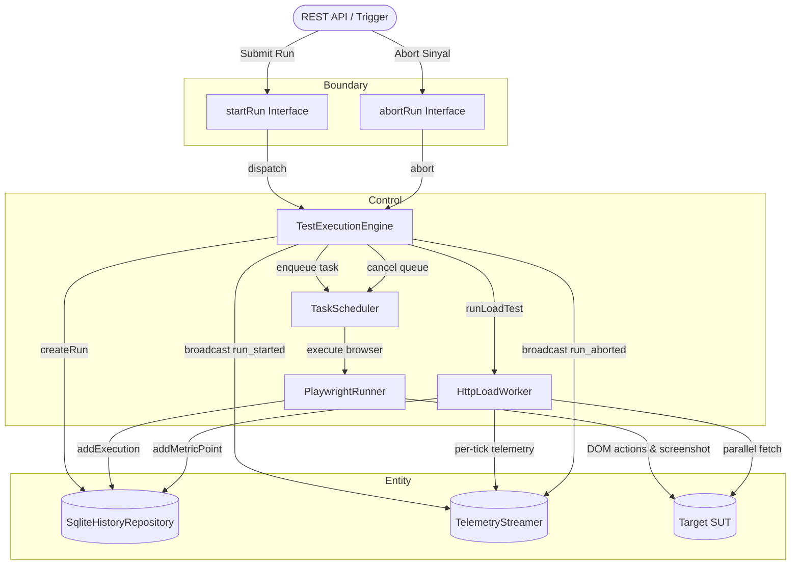

# DCD-02-Test-Orchestrator

> **Komponen:** Test Orchestrator & In-Memory Task Scheduler  
> **Source Code:** [`src/lib/server/engine.ts`](../../src/lib/server/engine.ts), [`src/lib/server/scheduler.ts`](../../src/lib/server/scheduler.ts)  
> **Spec Ref:** [SCD-01-Test-Orchestrator.md](../plan/component/SCD-01-Test-Orchestrator.md)  
> **Status:** `Active / Implemented`  

---

## 1. Object Identification

### Boundary
* `Interface: StartRunOptions` — Parameter input dispatch test run (`id`, `suiteName`, `testType`, `targetUrl`, `concurrency`, `scenarios`, `virtualUsers`, `durationSeconds`, `loadProfile`, `httpMethod`).
* `Interface: EngineStatus` — Representasi status mesin saat ini (`state`, `currentRunId`, `activeWorkers`, `totalTasks`, `completedTasks`, `currentRps`, `p95LatencyMs`).
* `Interface: SchedulerOptions` — Konfigurasi batas konkurensi antrean (`concurrency`).

### Control
* `Control: TestExecutionEngine` — Kelas orkestrator utama pengatur alur pengujian hibrida (Playwright + HTTP Load), pengelolaan lifecycle run, dan koordinasi antar modul.
* `Control: TaskScheduler` — Antrean tugas in-memory dengan throttle konkurensi berbasis Promise semaphore dan pembatalan instan (`abort()`).
* `Control: AbortSignalController` — Manajer `AbortController` yang menghentikan request HTTP aktif dan pemrosesan antrean saat sinyal abort diterima.
* `Control: TelemetryDispatcher` — Logika pemancar event status (`run_started`, `scenario_completed`, `screenshot_captured`, `run_completed`, `run_aborted`).

### Entity
* `Entity: TestRunRecord` — Record sesi pengujian di SQLite (`test_runs`).
* `Entity: ScenarioExecutionResult` — Hasil eksekusi skenario per-unit (`test_executions`).
* `Entity: LoadTestFinalSummary` — Ringkasan metrik beban hasil agregasi (`totalRequests`, `rps`, `errorRatePercent`, `avgLatencyMs`, `latency quantiles`).

---

## 2. Use Case List

| No | Use Case Name | Actor | Status | Detail |
|---|---|---|---|---|
| 1 | `UC-ORCH-01` — Orchestrate Test Run Execution | Engine Caller / API | Active | Section 3.1 |
| 2 | `UC-ORCH-02` — Enqueue & Throttle Concurrency | TaskScheduler | Active | Section 3.2 |
| 3 | `UC-ORCH-03` — Process Emergency Abort | User / SUT Overload | Active | Section 3.3 |
| 4 | `UC-ORCH-04` — Emit Realtime Telemetry Broadcast | TelemetryStreamer | Active | Section 3.4 |

---

## 3. Use Case Detail

### 3.1 `UC-ORCH-01`: Orchestrate Test Run Execution

* **Aktor:** REST API (`POST /api/runs`) / CLI Runner
* **Deskripsi:** Menerima opsi pengujian, mencatat status `QUEUED` ke database, mengeksekusi Playwright scenarios via scheduler, menjalankan HTTP load testing jika dikonfigurasi, dan memperbarui status akhir menjadi `COMPLETED` atau `FAILED`.
* **Normal Flow:**
  1. `startRun(options)` dipanggil dengan ID run dan parameter pengujian.
  2. Engine memanggil `storage.createRun(...)` untuk menyimpan sesi awal.
  3. Engine menginisialisasi `TaskScheduler` dengan batas concurrency yang ditentukan.
  4. Engine menyiarkan event SSE `run_started`.
  5. Skenario Playwright di-enqueue ke `TaskScheduler`. Setiap task memanggil `playwrightRunner.executeTargetScenario(...)`.
  6. Hasil setiap skenario disimpan ke `storage.addExecution(...)`, event `scenario_completed` dan `screenshot_captured` disiarkan via SSE.
  7. Jika mode `HYBRID` atau `ARTILLERY_ONLY`, engine menjalankan `httpLoadWorker.runLoadTest(...)` yang mengirim request paralel nyata dan mengalirkan metrik per-detik.
  8. Setelah seluruh proses selesai, durasi total dihitung dan status run diperbarui menjadi `COMPLETED`.
  9. Engine menyiarkan event SSE `run_completed` beserta data `loadSummary`.

---

### 3.2 `UC-ORCH-02`: Enqueue & Throttle Concurrency

* **Aktor:** `TaskScheduler` Internal Loop
* **Deskripsi:** Membatasi jumlah task asinkron yang berjalan serentak agar tidak melebihi batas kapasitas resource VPS.
* **Normal Flow:**
  1. Task fungsi asinkron dimasukkan via `scheduler.enqueue(fn)`.
  2. Jika jumlah worker aktif `< concurrency`, task langsung dieksekusi.
  3. Jika worker aktif mencapai batas, task dimasukkan ke array antrean `queue`.
  4. Ketika sebuah task selesai, worker aktif berkurang dan task berikutnya di antrean otomatis di-pop dan dijalankan.

---

### 3.3 `UC-ORCH-03`: Process Emergency Abort

* **Aktor:** User / Signal Handler
* **Deskripsi:** Membatalkan pengujian yang sedang berjalan secara instan.
* **Normal Flow:**
  1. `abortRun(reason)` dipanggil.
  2. `AbortController.abort()` dipicu untuk membatalkan seluruh request `fetch()` yang sedang aktif.
  3. `scheduler.abort(reason)` dipanggil: mengosongkan antrean yang belum berjalan dan menolak task yang menunggu.
  4. Status run di SQLite diperbarui menjadi `ABORTED`.
  5. Engine menyiarkan event SSE `run_aborted`.

---

## 4. Robustness Diagram (Mermaid BCE)

