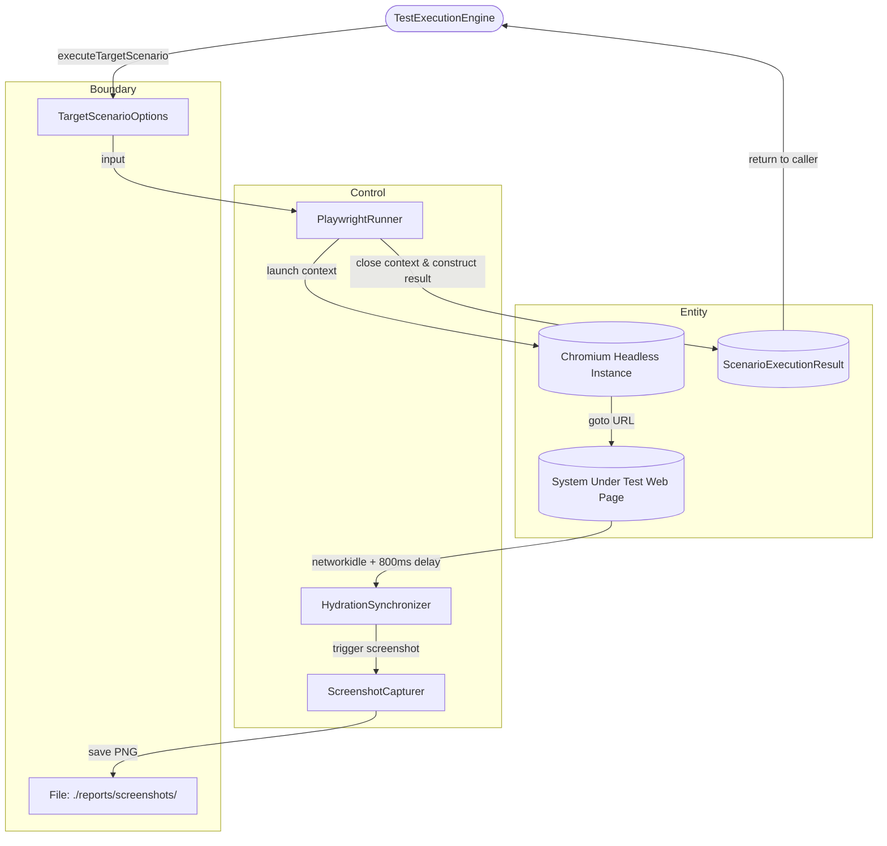

# DCD-03-Playwright-Worker

> **Komponen:** Playwright Headless Browser Worker Runner  
> **Source Code:** [`src/lib/server/playwright-runner.ts`](../../src/lib/server/playwright-runner.ts)  
> **Spec Ref:** [SCD-02-Playwright-Worker-Pool.md](../plan/component/SCD-02-Playwright-Worker-Pool.md)  
> **Status:** `Active / Implemented`  

---

## 1. Object Identification

### Boundary
* `Interface: ScenarioRunOptions` — Opsi eksekusi generic scenario (`testRunId`, `scenarioName`, `scenarioFn`, `maxRetries`).
* `Interface: TargetScenarioOptions` — Opsi navigasi target web nyata (`testRunId`, `scenarioName`, `targetUrl`, `screenshotDir`, `maxRetries`).
* `Directory: ./reports/screenshots/` — Lokasi penyimpanan file artifact gambar PNG tangkapan layar.

### Control
* `Control: PlaywrightRunner` — Kelas eksekutor browser Playwright Chromium headless.
* `Control: ContextLifecycleManager` — Pengatur pembuatan browser context terisolasi (`chromium.launch`, `browser.newContext({ viewport: { width: 1280, height: 800 } })`) dan penutupan bersih (`context.close()`, `browser.close()`).
* `Control: HydrationSynchronizer` — Logika sinkronisasi rendering halaman (`waitUntil: 'networkidle'` dengan fallback `load` state + 800ms hydration delay).
* `Control: RetryLoopManager` — Pengatur pengulangan eksekusi skenario jika terjadi error transien (*flaky test*).
* `Control: ScreenshotCapturer` — Generator file gambar PNG hasil eksekusi (`page.screenshot`).

### Entity
* `Entity: ScenarioExecutionResult` — Struktur data hasil akhir (`testRunId`, `scenarioName`, `status`, `durationMs`, `retryCount`, `errorMessage`, `screenshotPath`).
* `Entity: Chromium Headless Instance` — Process browser native Chromium dengan flags `--no-sandbox`, `--disable-dev-shm-usage`.

---

## 2. Use Case List

| No | Use Case Name | Actor | Status | Detail |
|---|---|---|---|---|
| 1 | `UC-PW-01` — Execute Target URL E2E Navigation | Orchestrator | Active | Section 3.1 |
| 2 | `UC-PW-02` — Capture Full Hydrated Screenshot Evidence | PlaywrightRunner | Active | Section 3.2 |
| 3 | `UC-PW-03` — Retry Flaky Scenarios on Error | PlaywrightRunner | Active | Section 3.3 |

---

## 3. Use Case Detail

### 3.1 `UC-PW-01`: Execute Target URL E2E Navigation

* **Aktor:** Test Orchestrator (`engine.ts`)
* **Deskripsi:** Membuka browser headless Chromium baru, menavigasi ke URL target yang diuji, menunggu seluruh request AJAX/Fetch selesai, dan mengambil screenshot.
* **Normal Flow:**
  1. `executeTargetScenario(options)` dipanggil.
  2. Runner memastikan direktori `./reports/screenshots` telah ada.
  3. Chromium browser di-launch dengan isolasi argumen sandbox VPS.
  4. Context dan Page baru dibuat dengan viewport 1280x800.
  5. `page.goto(targetUrl, { waitUntil: 'networkidle', timeout: 15000 })` dieksekusi.
  6. Buffer penantian hidrasi 800ms (`waitForTimeout(800)`) dijalankan agar seluruh JavaScript client-side (SPA/Swagger/React) selesai merender elemen.
  7. Tangkapan layar disimpan ke `./reports/screenshots/target-<testRunId>-<name>.png`.
  8. Context dan browser ditutup secara bersih.
  9. Runner mengembalikan objek `ScenarioExecutionResult` berstatus `PASSED`.

#### Exception Flow:
* 5a. Networkidle timeout (karena target memiliki polling koneksi terbuka berkala): Runner menangkap error dan beralih ke fallback `page.waitForLoadState('load')`.
* 5b. URL tidak dapat diakses (DNS gagal / connection refused): Browser ditutup dalam blok `finally`/`catch`, mengembalikan status `FAILED` dengan `errorMessage` yang tercatat di SQLite.

---

### 3.2 `UC-PW-02`: Capture Full Hydrated Screenshot Evidence

* **Aktor:** `PlaywrightRunner`
* **Deskripsi:** Mengambil screenshot tampilan aktual target web yang sudah ter-render sempurna tanpa spinner loading.
* **Normal Flow:**
  1. Setelah tahap navigasi dan hidrasi selesai, `page.screenshot({ path: screenshotPath, fullPage: false })` dipanggil.
  2. File PNG tersimpan di `./reports/screenshots/`.
  3. Path file disematkan ke field `screenshotPath` dalam hasil eksekusi dan disiarkan via SSE ke dashboard web.

---

## 4. Robustness Diagram (Mermaid BCE)

