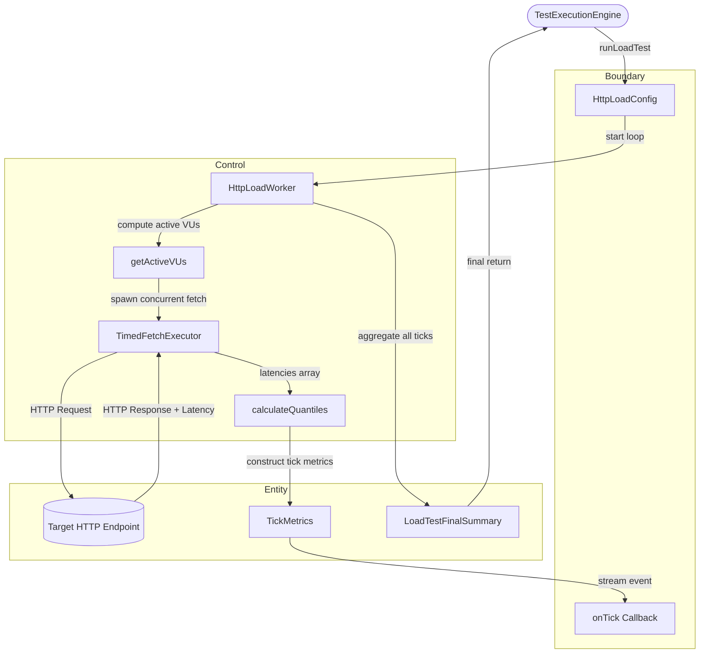

# DCD-04-HTTP-Load-Generator

> **Komponen:** Real HTTP Load Generator & Quantiles Calculation Engine  
> **Source Code:** [`src/lib/server/http-load-worker.ts`](../../src/lib/server/http-load-worker.ts), [`src/lib/server/artillery-runner.ts`](../../src/lib/server/artillery-runner.ts)  
> **Spec Ref:** [SCD-03-Load-Generator-Artillery.md](../plan/component/SCD-03-Load-Generator-Artillery.md)  
> **Status:** `Active / Implemented`  

---

## 1. Object Identification

### Boundary
* `Interface: HttpLoadConfig` — Konfigurasi pengujian beban (`targetUrl`, `httpMethod`, `virtualUsers`, `durationSeconds`, `loadProfile`, `requestTimeoutMs`, `abortSignal`).
* `Callback: onTick(metrics)` — Callback event per-detik penghasil snapshot metrik.

### Control
* `Control: HttpLoadWorker` — Kelas traffic generator yang mengeksekusi request HTTP paralel nyata per-detik.
* `Control: VUScalingAlgorithm (getActiveVUs)` — Algoritma penentu jumlah VU aktif per detik berdasarkan profil (`fixed`, `ramp-up`, `spike`).
* `Control: TimedFetchExecutor` — Wrapper fungsi `fetch()` native dengan timer latensi milidetik dan listener `AbortSignal`.
* `Control: QuantileCalculator (calculateQuantiles)` — Fungsi kalkulator persentil statistik (`Min`, `Max`, `p50`, `p90`, `p95`, `p99`) dengan formula nearest rank.
* `Control: ArtilleryRunner` — Modul agregator hasil respons beban.

### Entity
* `Entity: TickMetrics` — Snapshot data metrik per detik (`tick`, `activeVUs`, `requestsThisTick`, `currentRps`, `p50LatencyMs`, `p95LatencyMs`, `p99LatencyMs`, `errorsThisTick`, `errorRatePercent`, `totalRequestsSoFar`).
* `Entity: LoadTestFinalSummary` — Ringkasan metrik akhir (`totalRequests`, `successfulRequests`, `failedRequests`, `rps`, `errorRatePercent`, `avgLatencyMs`, `latency`, `tickHistory`).
* `Entity: LatencyQuantiles` — Objek quantile latensi (`min`, `max`, `p50`, `p90`, `p95`, `p99`).

---

## 2. Use Case List

| No | Use Case Name | Actor | Status | Detail |
|---|---|---|---|---|
| 1 | `UC-LOAD-01` — Generate Real HTTP Traffic by Profile | Orchestrator | Active | Section 3.1 |
| 2 | `UC-LOAD-02` — Scale Virtual Users Dynamically | HttpLoadWorker | Active | Section 3.2 |
| 3 | `UC-LOAD-03` — Compute Latency Quantiles (Nearest Rank) | ArtilleryRunner | Active | Section 3.3 |
| 4 | `UC-LOAD-04` — Handle Request Timeout & Abort | TimedFetchExecutor | Active | Section 3.4 |

---

## 3. Use Case Detail

### 3.1 `UC-LOAD-01`: Generate Real HTTP Traffic by Profile

* **Aktor:** Test Orchestrator (`engine.ts`)
* **Deskripsi:** Menjalankan loop waktu per detik selama durasi yang ditentukan, memicu request paralel sebanyak `activeVUs`, mengumpulkan response time, dan mengembalikan ringkasan performa 12 metrik.
* **Normal Flow:**
  1. `runLoadTest(config, onTick)` dipanggil.
  2. Loop dimulai dari `tick = 1` hingga `durationSeconds`.
  3. Worker menghitung `activeVUs = getActiveVUs(...)`.
  4. Worker memicu `activeVUs` pemanggilan `timedFetch` secara serentak via `Promise.allSettled()`.
  5. Setiap respon mencatat `statusCode` dan `latencyMs`.
  6. Metrik kuantil detik tersebut dihitung dan di-pass ke callback `onTick(tickMetrics)`.
  7. Worker menunggu sisa interval waktu 1 detik sebelum masuk ke tick berikutnya.
  8. Setelah seluruh tick selesai, ringkasan akhir `LoadTestFinalSummary` dikompilasi dan dikembalikan ke pemanggil.

---

### 3.2 `UC-LOAD-02`: Scale Virtual Users Dynamically

* **Aktor:** `getActiveVUs(profile, targetVUs, elapsed, total)`
* **Logika Profil:**
  * **`fixed`**: Mengembalikan nilai konstan `targetVUs`.
  * **`ramp-up`**: Menghitung rasio linier `(elapsed / total) * targetVUs` (skala 1 ➔ targetVUs).
  * **`spike`**: Mengembalikan 10% VUs pada fase awal (<30%), 100% VUs pada fase puncak (30–70%), dan kembali ke 10% VUs pada fase akhir (>70%).

---

### 3.3 `UC-LOAD-03`: Compute Latency Quantiles (Nearest Rank)

* **Aktor:** `calculateQuantiles(latencies)`
* **Deskripsi:** Mengurutkan array latensi secara ascending dan menghitung nilai kuantil persentil menggunakan formula rank: $\text{rank} = \lceil (p / 100) \times N \rceil$.

---

## 4. Robustness Diagram (Mermaid BCE)

