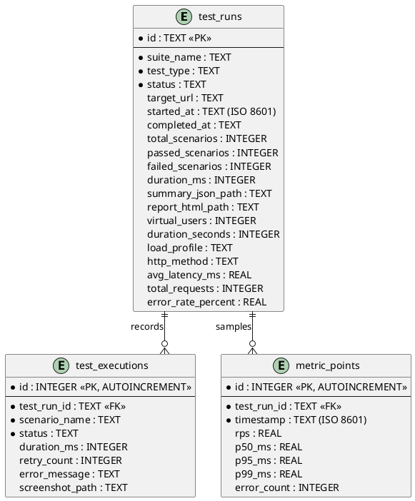

# Database Design Document: SQLite ERD Overview

## 1. Ringkasan

Dokumen ini mendefinisikan skema tabel **SQLite** (`./data/test_history.db`) untuk **Lean Load Testing & Playwright Platform**. Menggunakan SQLite dengan WAL mode (`PRAGMA journal_mode = WAL;`) memberikan performa write yang cepat tanpa overhead server database terpisah.

**Source of Truth:** [`src/lib/server/storage.ts`](../../src/lib/server/storage.ts)

---

## 2. Entity Relationship Diagram (PlantUML IE)



---

## 3. DDL Schema SQLite

```sql
-- Inisialisasi PRAGMA untuk performa & konkurensi maksimal
PRAGMA journal_mode = WAL;
PRAGMA synchronous = NORMAL;

CREATE TABLE IF NOT EXISTS test_runs (
    id TEXT PRIMARY KEY,
    suite_name TEXT NOT NULL,
    test_type TEXT NOT NULL,
    status TEXT NOT NULL,
    target_url TEXT,
    started_at TEXT NOT NULL,
    completed_at TEXT,
    total_scenarios INTEGER DEFAULT 0,
    passed_scenarios INTEGER DEFAULT 0,
    failed_scenarios INTEGER DEFAULT 0,
    duration_ms INTEGER DEFAULT 0,
    summary_json_path TEXT,
    report_html_path TEXT,
    virtual_users INTEGER DEFAULT 1,
    duration_seconds INTEGER DEFAULT 30,
    load_profile TEXT DEFAULT 'fixed',
    http_method TEXT DEFAULT 'GET',
    avg_latency_ms REAL DEFAULT 0,
    total_requests INTEGER DEFAULT 0,
    error_rate_percent REAL DEFAULT 0
);

CREATE TABLE IF NOT EXISTS test_executions (
    id INTEGER PRIMARY KEY AUTOINCREMENT,
    test_run_id TEXT NOT NULL,
    scenario_name TEXT NOT NULL,
    status TEXT NOT NULL,
    duration_ms INTEGER DEFAULT 0,
    retry_count INTEGER DEFAULT 0,
    error_message TEXT,
    screenshot_path TEXT,
    FOREIGN KEY(test_run_id) REFERENCES test_runs(id) ON DELETE CASCADE
);

CREATE TABLE IF NOT EXISTS metric_points (
    id INTEGER PRIMARY KEY AUTOINCREMENT,
    test_run_id TEXT NOT NULL,
    timestamp TEXT NOT NULL,
    rps REAL DEFAULT 0,
    p50_ms REAL DEFAULT 0,
    p95_ms REAL DEFAULT 0,
    p99_ms REAL DEFAULT 0,
    error_count INTEGER DEFAULT 0,
    FOREIGN KEY(test_run_id) REFERENCES test_runs(id) ON DELETE CASCADE
);

CREATE INDEX IF NOT EXISTS idx_runs_date ON test_runs(started_at DESC);
CREATE INDEX IF NOT EXISTS idx_exec_run ON test_executions(test_run_id);
CREATE INDEX IF NOT EXISTS idx_metrics_run ON metric_points(test_run_id, timestamp);
```

---

## 4. Data Dictionary Reference

Dokumen Data Dictionary detail per-tabel tersedia di folder yang sama:
- [DD-01-test-runs.md](./DD-01-test-runs.md)
- [DD-02-test-executions.md](./DD-02-test-executions.md)
- [DD-03-metric-points.md](./DD-03-metric-points.md)
