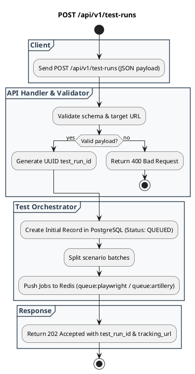

# REST API Spec: Submit Test Run

## 1. Metadata

| Method | Endpoint | Description |
|---|---|---|
| POST | `/api/v1/test-runs` | Submit payload konfigurasi pengujian baru dan enqueue task ke worker pool. |

---

## 2. Diagram Swimlane



---

## 3. API Spec

### 3.1 Authentication
* `API Key` (Header: `X-API-Key: <token>`) atau `Bearer Token`

### 3.2 Request Headers
* `Content-Type: application/json`

### 3.3 Request Body
```json
{
  "suiteName": "Checkout Regression & Stress Test",
  "targetUrl": "https://staging.app.example.com",
  "testType": "HYBRID", 
  "playwright": {
    "scenarios": ["e2e/checkout.spec.ts", "e2e/login.spec.ts"],
    "browser": "chromium",
    "concurrency": 10,
    "retries": 2
  },
  "artillery": {
    "scenarioFile": "load/checkout-spike.yml",
    "targetRps": 250,
    "durationSeconds": 60
  }
}
```

### 3.4 Response Contract

#### Success Response: `202 Accepted`
```json
{
  "status": "success",
  "data": {
    "testRunId": "550e8400-e29b-41d4-a716-446655440000",
    "status": "QUEUED",
    "submittedAt": "2026-08-31T10:45:00Z",
    "totalTasksQueued": 11,
    "trackingUrl": "/api/v1/test-runs/550e8400-e29b-41d4-a716-446655440000"
  }
}
```

#### Error Response: `400 Bad Request`
```json
{
  "status": "error",
  "code": "INVALID_TEST_CONFIGURATION",
  "message": "Field 'targetUrl' must be a valid HTTP/HTTPS URL",
  "details": ["targetUrl is required", "playwright.concurrency must be between 1 and 50"]
}
```

---

## 4. Rules

1. `testType` harus bernilai salah satu dari: `PLAYWRIGHT_ONLY`, `ARTILLERY_ONLY`, atau `HYBRID`.
2. Jika `concurrency` melebihi kuota worker yang aktif, orchestrator akan membatasi ke batas maksimum worker yang tersedia.
3. Seluruh task didaftarkan dengan timeout global (default 15 menit) untuk mencegah hanging job.

---

## 5. Asumsi, Risiko, dan Hal yang Perlu Dikonfirmasi

| Item | Tipe | Catatan |
|---|---|---|
| Async Execution | Asumsi | Endpoint mengembalikan HTTP `202 Accepted` dan status dipantau secara asinkron. |
| Webhook Callback | Perlu Dikonfirmasi | Apakah user ingin menambahkan field `webhookUrl` di request body untuk notifikasi saat test run selesai? |
