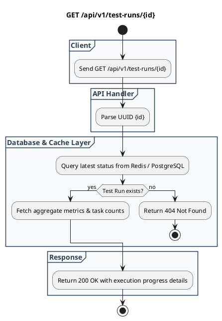

# REST API Spec: Get Test Run Status

## 1. Metadata

| Method | Endpoint | Description |
|---|---|---|
| GET | `/api/v1/test-runs/{id}` | Mengambil detail progres eksekusi, status worker, dan metrik latensi dari sesi test run. |

---

## 2. Diagram Swimlane



---

## 3. API Spec

### 3.1 Authentication
* `API Key` (Header: `X-API-Key: <token>`) atau `Bearer Token`

### 3.2 Path Parameter
| Parameter | Tipe | Wajib | Deskripsi |
|---|---|---|---|
| `id` | UUID | Ya | Identifier unik sesi test run (`test_run_id`). |

### 3.3 Response Contract

#### Success Response: `200 OK`
```json
{
  "status": "success",
  "data": {
    "testRunId": "550e8400-e29b-41d4-a716-446655440000",
    "suiteName": "Checkout Regression & Stress Test",
    "status": "RUNNING",
    "startedAt": "2026-08-31T10:45:02Z",
    "completedAt": null,
    "durationSeconds": 34,
    "progress": {
      "totalPlaywrightScenarios": 10,
      "completedPlaywrightScenarios": 6,
      "failedPlaywrightScenarios": 0,
      "currentRps": 248.5,
      "totalRequestsSent": 8450
    },
    "metricsSummary": {
      "p50LatencyMs": 42.1,
      "p90LatencyMs": 115.4,
      "p99LatencyMs": 280.0,
      "errorRatePercent": 0.02
    }
  }
}
```

#### Error Response: `404 Not Found`
```json
{
  "status": "error",
  "code": "TEST_RUN_NOT_FOUND",
  "message": "Test run with ID '550e8400-e29b-41d4-a716-446655440000' was not found"
}
```

---

## 4. Rules

1. Jika status adalah `RUNNING`, data metrik progres diambil dari in-memory cache / Redis untuk menghindari pembebanan query database berulang.
2. Jika status adalah `COMPLETED` atau `FAILED`, data lengkap dibaca dari tabel PostgreSQL `test_runs` dan `metric_snapshots`.

---

## 5. Asumsi, Risiko, dan Hal yang Perlu Dikonfirmasi

| Item | Tipe | Catatan |
|---|---|---|
| Cache Expiry | Asumsi | Snapshot realtime di Redis memiliki TTL 1 jam setelah run selesai. |
